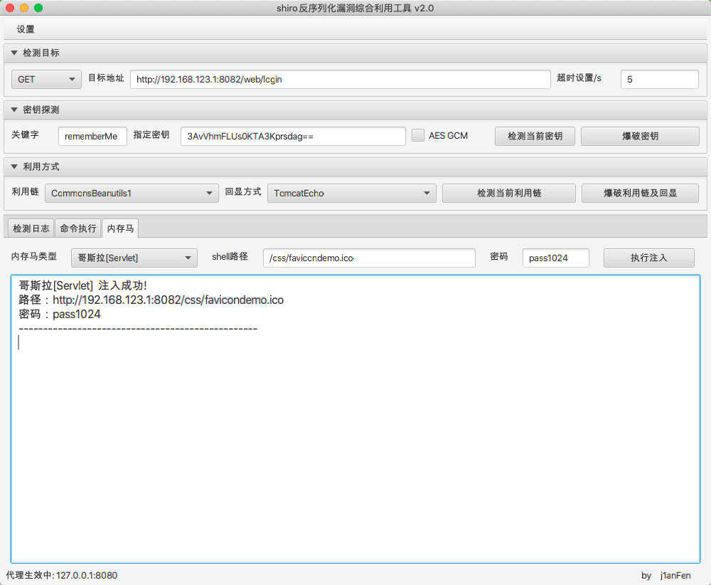

## 漏洞概述

在 Shiro 1.2.4 及之前的版本，Shiro 秘钥是硬编码的一个值 `kPH+bIxk5D2deZiIxcaaaA==`，这便是 Shiro-550 的漏洞成因。

但这个漏洞不只存在于 1.2.4 版本，后续版本的读取流程没有什么改动，这就意味着只要秘钥泄露，依然存在高危风险。

Shiro Top 100 Key 是基于一些 Github 示例代码收集的

## 影响范围

```http
Shiro <= 1.2.4
```

## 漏洞利用

1、**扫描探测可利用的Key和Gadget利用链**

[@wyzxxz](https://github.com/wyzxxz/shiro_rce_tool) 一键工具（可回显）

```bash
java -jar shiro_tool.jar http://xxshiro.com/login
```

有Key和Gadget利用链：

1）看下是不是jar包部署的，不是的话直接传webshell

2）jar包部署的看看能不能出网，能出网（反弹shell），不能出网（传内存马）

2、**上传内存马**

[@j1anFen](https://github.com/j1anFen/shiro_attack) （回显执行命令/注入内存马）



## 扩展链接

[Shiro RememberMe 漏洞检测的探索之路](https://paper.seebug.org/1285/)

[Shiro550 无Commons-collections依赖利用工具](https://github.com/dr0op/shiro-550-with-NoCC)

