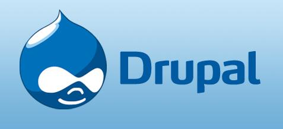

## 应用简介



Drupal是使用PHP语言编写的开源内容管理框架（CMF），它由内容管理系统（CMS）和PHP开发框架（Framework）共同构成。

官方网站：https://www.drupal.org

中文官网：http://drupalchina.cn/index.php

## 相关资产

```http
app="Drupal"
```

## 环境搭建

VulnRange