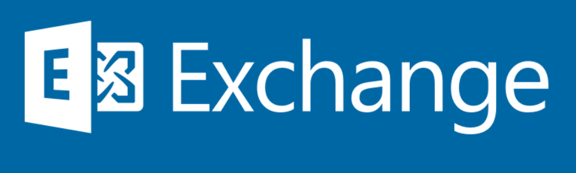

## 应用简介



Exchange Server 是微软公司的一套电子邮件服务组件，是个消息与协作系统。 

简单而言，Exchange server可以被用来构架应用于企业、学校的邮件系统。

Exchange是收费邮箱，但是国内微软并不直接出售Exchange邮箱，而是将Exchange、Lync、Sharepoint三款产品包装成Office365出售。

Exchange server还是一个协作平台。在此基础上可以开发工作流，知识管理系统，Web系统或者是其他消息系统。

## 相关资产

FOFA

```http
title=="Outlook" && country="CN"
body="<!-- {57A118C6-2DA9-419d-BE9A-F92B0F9A418B} -->"
icon_hash="1768726119"
```

ZoomEye

```http
title:"Outlook"
```

## 环境搭建

[部署新的 Exchange 安装（微软）](https://docs.microsoft.com/zh-cn/exchange/plan-and-deploy/deploy-new-installations/deploy-new-installations?view=exchserver-2019)