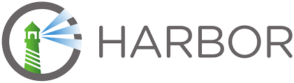

## 应用简介



开源的企业级的Docker Registry管理项目，包括权限管理(RBAC)、LDAP、日志审核、管理界面、自我注册、镜像复制和中文支持等功能。Docker镜像仓库。

Git源码仓库：https://github.com/goharbor/harbor

## 相关资产

FOFA

```http
app="HARBOR"
```

## 环境搭建

[Harbor安装与基本配置](https://blog.csdn.net/m0_37929348/article/details/105149542)