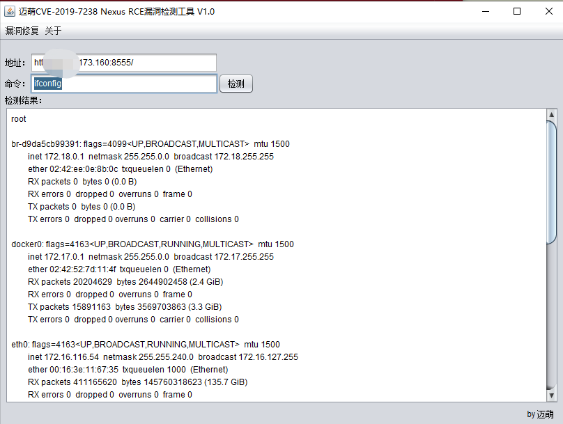

## 漏洞概述

由于 Nexus Repository Manager 3 访问控制措施缺失，未授权的用户可利用该问题构造特定请求在服务器上执行 Java 代码，从而达到远程代码执行的目的，影响系统安全。

## 影响范围

```http
Nexus Repository Manager OSS/Pro 3.6.2~3.14.0
```

## EXP

CVE-2019-7238.jar 图形化检测工具



