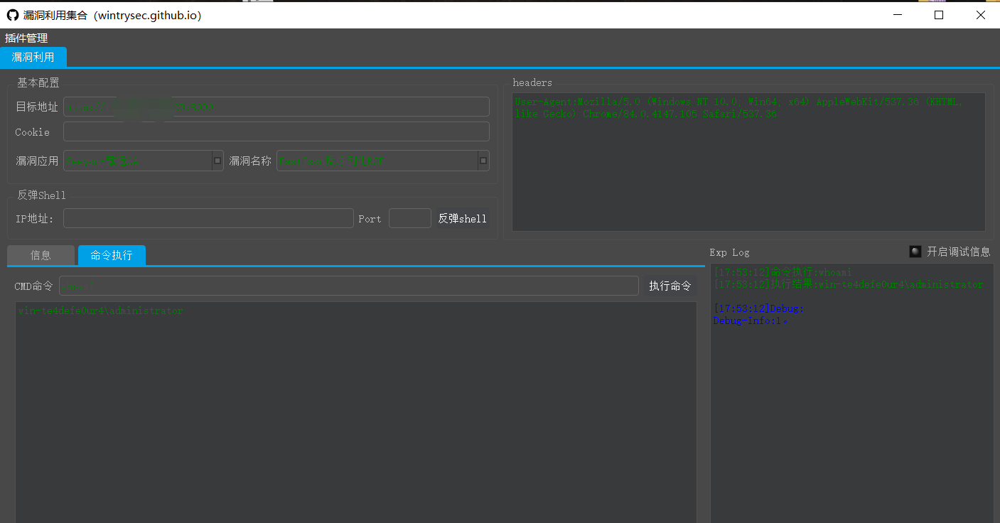

## 快乐星球


## 收录范围

```
HVV：收录各种高危可Getshell的漏洞-以及相关应用Getshell的技巧方法
```

POC（支持批量验证）

```http
nuclei-集成于大宝剑内
Goby
Python（数据来源Github、自编写）
```

EXP

```http
Metasploit
jar包 （数据来源Github、自编写）
python脚本
```

## 推荐使用方式

**漏洞扫描**可直接使用 大宝剑[DBJ](https://github.com/wgpsec/DBJ)一键下任务（POC跟此仓库同步中）

**漏洞利用**使用的是[qianxiao996](https://github.com/qianxiao996)师傅写的漏洞利用框架改的（EXP同步中，差不多就放出来）

可直接执行命令和反弹shell



## 类似项目

**[佩奇文库](https://github.com/PeiQi0/PeiQi-WIKI-POC)**-漏洞复现及POC文库

**[Middleware-Vulnerability-detection](https://github.com/mai-lang-chai/Middleware-Vulnerability-detection)**-CVE、CMS、中间件漏洞检测利用合集

**[nuclei](https://github.com/projectdiscovery/nuclei-templates)**-核漏洞扫描器

**[fscan](https://github.com/shadow1ng/fscan)**-内网综合扫描

## ToDo

现在仅仅是收集整理，后续逐步深入分析利用技巧和形成原因及技术原理

```http
网络设备&（默认口令）
```

