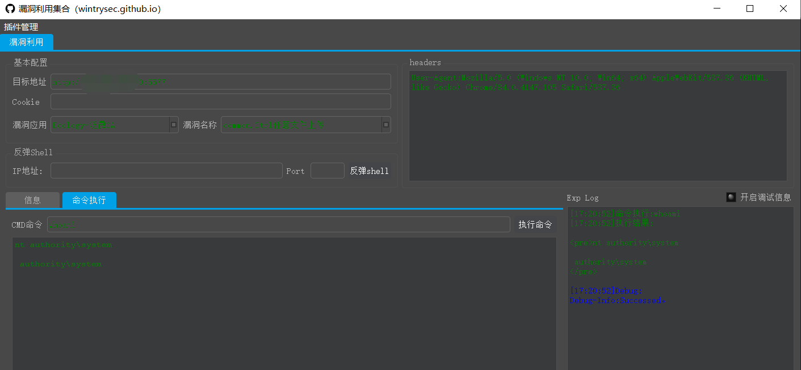

## 漏洞概述

泛微OA `weaver.common.Ctrl` 存在任意文件上传漏洞，可以上传webshell文件控制服务器

## 影响范围

```http
V9
```

## POC（批量）

1、将目标 HOST 或URL 放进`urls.txt`

2、直接运行脚本

```bash
python Ecology-RCE_批量POC(仅验证).py
```

3、脚本将输出上传的文件的链接，上传了个无害`TXT`文本文件上去

## EXP

直接一键利用（可将脚本里的马更换为免杀马）

此工具下载地址见项目主页

